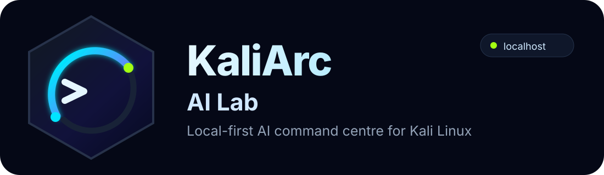
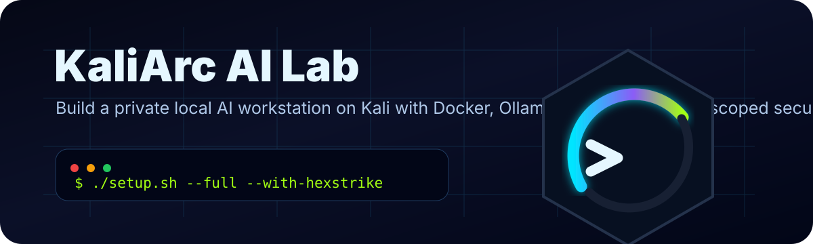
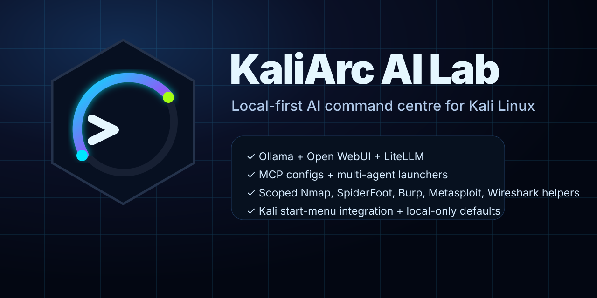
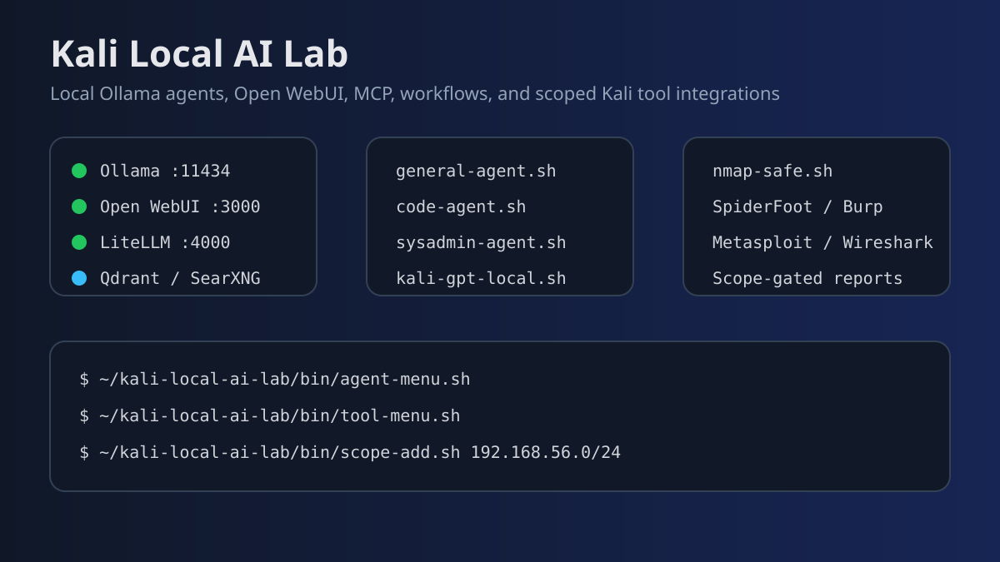
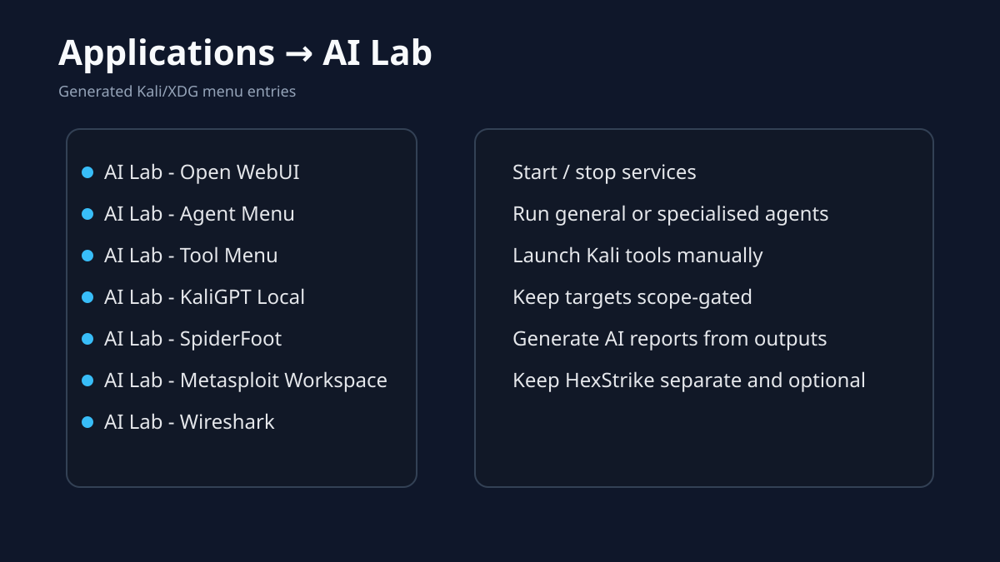
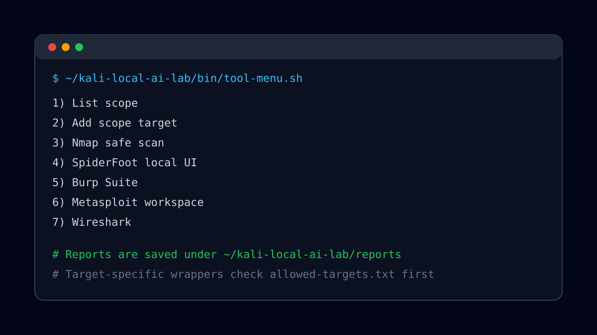
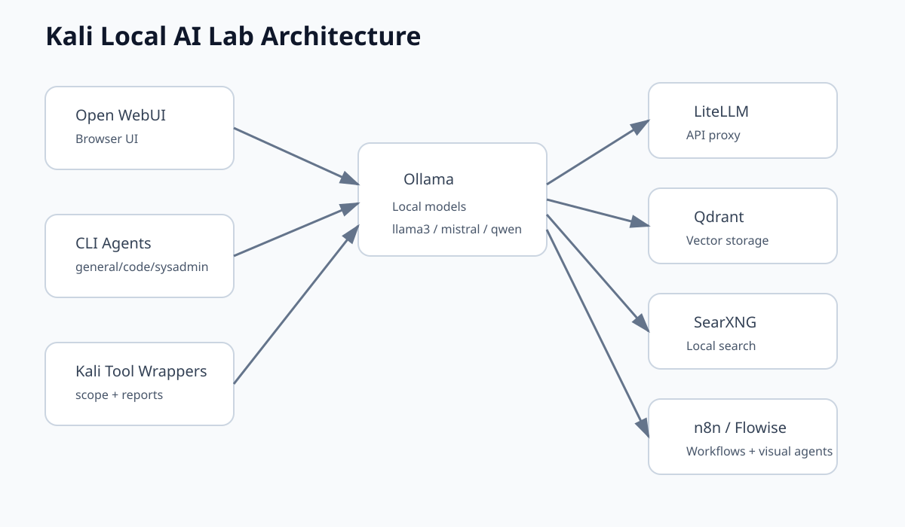

<p align="center">
  
</p>

<p align="center">
  <strong>Local-first AI command centre for Kali Linux.</strong><br>
  Ollama · Open WebUI · LiteLLM · MCP · local agents · scoped Kali tool integrations · optional HexStrike
</p>

<p align="center">
  
  
  
  
</p>



# KaliArc AI Lab

**KaliArc AI Lab** is a GitHub-ready, local-first AI workstation build for Kali Linux. It combines Ollama, Open WebUI, local agents, MCP configs, workflow tools, scoped Kali tool integrations, Kali start-menu launchers, and optional HexStrike support.

The name **KaliArc** means “an arc between everyday AI work and authorised security lab workflows”: one side for general productivity and coding, the other for scoped security-tool analysis.

This project is designed as a clean split between:

- **General AI work**: writing, coding, sysadmin, study, automation, and troubleshooting.
- **KaliGPT-style work**: local Kali/Linux help, command explanations, lab workflows, and report writing.
- **Authorised security tooling**: Nmap, SpiderFoot, Burp Suite, Metasploit, Wireshark/TShark, OWASP ZAP, OSINT helpers, reports, and optional HexStrike.
- **Local web apps**: Open WebUI, LiteLLM, Qdrant, SearXNG, n8n, and Flowise.

> Generated images in this README are SVG mockups/diagrams included in the repo. 
>
> Kali Linux is a trademark of OffSec. This is an independent community project and is not affiliated with or endorsed by OffSec.

---

## Brand assets

| Asset | Preview |
|---|---|
| Full logo |  |
| Logo mark |  |
| Repository banner |  |

Recommended repo description:

```text
KaliArc AI Lab: local-first AI command centre for Kali Linux with Ollama, Open WebUI, MCP agents, scoped Kali tool integrations, start-menu launchers, and optional HexStrike.
```

Recommended repo topics:

```text
kali-linux ollama open-webui mcp local-ai ai-agents docker cybersecurity-lab nmap spiderfoot burp-suite metasploit wireshark
```

---

## Screenshots

### AI Lab overview



### Kali start menu integration



### Tool menu



### Architecture



---

## Features

### Core local AI stack

- Docker-based install for Kali Linux.
- Ollama local LLM runtime.
- Open WebUI on `127.0.0.1:3000`.
- LiteLLM OpenAI-compatible API proxy.
- Qdrant vector database.
- SearXNG local search backend.
- n8n workflow automation.
- Flowise visual AI-agent builder.
- Local MCP config generation.
- Safe local MCP server for system/lab inspection.
- Optional HexStrike local MCP wiring.

### Included Ollama models

Default pulls include:

```text
gemma3:latest
llama3:latest
mistral:latest
qwen2.5-coder:7b
nomic-embed-text:latest
```

You can override the list:

```bash
./setup.sh --models llama3:latest,mistral:latest,qwen2.5-coder:7b
```

### Local agents

The repo adds these launchers under `~/kaliarc-ai-lab/bin/`:

| Launcher | Purpose |
|---|---|
| `general-agent.sh` | General non-pentest assistant |
| `code-agent.sh` | Coding and script review |
| `sysadmin-agent.sh` | Linux/Kali/Docker/sysadmin help |
| `kali-gpt-local.sh` | Local KaliGPT-style assistant |
| `report-agent.sh` | Summarise command output into findings |
| `agent.sh` | Multi-agent Planner/Builder/Reviewer/Reporter workflow |
| `agent-menu.sh` | Interactive menu for agents |

### Kali tool integrations

The extras installer creates scoped wrappers and launchers for:

| Tool | Integration |
|---|---|
| Nmap | `nmap-safe.sh` with scope enforcement and report output |
| SpiderFoot | `spiderfoot-local.sh` local UI launcher |
| Burp Suite | `burp-suite.sh` launcher |
| Metasploit | `metasploit-workspace.sh` opens a lab workspace |
| Wireshark | `wireshark-launch.sh` launcher |
| TShark | `tshark-capture.sh` timed capture helper |
| OWASP ZAP | `zap-local.sh` localhost launcher |
| OSINT helpers | `osint-domain.sh` for scoped domain snapshots |
| AI reporting | `report-file.sh` summarises outputs with a local model |

Target-specific wrappers check:

```text
~/kaliarc-ai-lab/scope/allowed-targets.txt
```

Add authorised scope:

```bash
~/kaliarc-ai-lab/bin/scope-add.sh 192.168.56.0/24
~/kaliarc-ai-lab/bin/scope-add.sh example.test
```

### Kali start menu

The extras installer adds a new desktop menu:

```text
Applications → AI Lab
```

Menu entries include:

- Open WebUI
- Agent Menu
- Tool Menu
- KaliGPT Local
- General Agent
- Code Agent
- Start/Stop/Status
- SpiderFoot
- Burp Suite
- Metasploit Workspace
- Wireshark
- Flowise
- n8n
- SearXNG
- HexStrike launcher when enabled

---

## Install

### 1. Clone your repository

After you upload this project to GitHub:

```bash
git clone https://github.com/YOUR-USERNAME/kaliarc-ai-lab.git
cd kaliarc-ai-lab
```

### 2. Run full install

```bash
chmod +x setup.sh install.sh scripts/*.sh
./setup.sh --full --with-hexstrike
```

### 3. Optional GPU hint

```bash
./setup.sh --full --with-hexstrike --gpu
```

You still need working NVIDIA drivers and NVIDIA Container Toolkit on the host.

### 4. Lite install

```bash
./setup.sh --lite
```

Lite mode installs the core Ollama/Open WebUI/local-agent setup without the full extras profile in Docker.

---

## Usage

### Check status

```bash
~/kaliarc-ai-lab/bin/status.sh
```

### Open WebUI

```text
http://127.0.0.1:3000
```

### Agent menu

```bash
~/kaliarc-ai-lab/bin/agent-menu.sh
```

### Tool menu

```bash
~/kaliarc-ai-lab/bin/tool-menu.sh
```

### General AI agent

```bash
~/kaliarc-ai-lab/bin/general-agent.sh "Create a weekly Linux study plan"
```

### Code agent

```bash
~/kaliarc-ai-lab/bin/code-agent.sh --file ./install.sh "Review this Bash script"
```

### KaliGPT local

```bash
~/kaliarc-ai-lab/bin/kali-gpt-local.sh "Explain how to troubleshoot DNS on Kali"
```

### Multi-agent workflow

```bash
~/kaliarc-ai-lab/bin/agent.sh --save "Create a safe local lab maintenance checklist"
```

### Scoped Nmap scan

```bash
~/kaliarc-ai-lab/bin/scope-add.sh 192.168.56.0/24
~/kaliarc-ai-lab/bin/nmap-safe.sh 192.168.56.10 -Pn
```

### AI report from a scan

```bash
~/kaliarc-ai-lab/bin/report-file.sh ~/kaliarc-ai-lab/reports/nmap-YYYYMMDD-HHMMSS.nmap
```

---

## Local service URLs

| Service | URL |
|---|---|
| Open WebUI | `http://127.0.0.1:3000` |
| Ollama API | `http://127.0.0.1:11434` |
| LiteLLM API | `http://127.0.0.1:4000` |
| SearXNG | `http://127.0.0.1:8088` |
| n8n | `http://127.0.0.1:5678` |
| Flowise | `http://127.0.0.1:3001` |
| Qdrant dashboard | `http://127.0.0.1:6333/dashboard` |
| SpiderFoot | `http://127.0.0.1:5001` when launched |
| HexStrike | `http://127.0.0.1:8888` when launched |

---

## Repository layout

```text
.
├── setup.sh                         # Recommended installer entry point
├── install.sh                       # Core installer
├── scripts/
│   ├── post-install-extras.sh        # Agent/tool/menu extras
│   └── validate.sh                   # bash -n / shellcheck checks
├── docs/
│   ├── ARCHITECTURE.md
│   ├── SECURITY_MODEL.md
│   ├── TOOL_INTEGRATIONS.md
│   └── TROUBLESHOOTING.md
├── examples/
│   ├── prompts.md
│   └── scope.example.txt
├── assets/
│   ├── brand/
│   ├── diagrams/
│   └── screenshots/
├── .github/workflows/shellcheck.yml
├── .env.example
├── BRANDING.md
├── LICENSE
├── SECURITY.md
├── CONTRIBUTING.md
└── CHANGELOG.md
```

---

## Updating

```bash
cd kaliarc-ai-lab
git pull
./setup.sh --full --with-hexstrike
```

Pull or refresh models:

```bash
~/kaliarc-ai-lab/bin/pull-models.sh
```

---

## Backup

```bash
~/kaliarc-ai-lab/bin/backup-volumes.sh
```

Backups are stored under:

```text
~/kaliarc-ai-lab/backups/
```

---

## Uninstall

Stop containers:

```bash
~/kaliarc-ai-lab/bin/stop.sh
```

Remove containers but keep volumes:

```bash
~/kaliarc-ai-lab/bin/uninstall.sh
```

Remove containers and Docker volumes:

```bash
~/kaliarc-ai-lab/bin/uninstall.sh --volumes
```

Remove menu entries:

```bash
~/kaliarc-ai-lab/bin/remove-menu.sh
```

---

## Recommended first GitHub push

```bash
git init
git add .
git commit -m "Initial KaliArc AI Lab release"
git branch -M main
git remote add origin https://github.com/YOUR-USERNAME/kaliarc-ai-lab.git
git push -u origin main
```

---

## Notes

- The default bind address is `127.0.0.1`.
- Do not expose local AI services to untrusted networks without authentication, firewalling, and reverse proxy hardening.
- HexStrike is optional and kept separate from the general agents.
- Target-specific wrappers are designed for local labs and authorised systems only.
